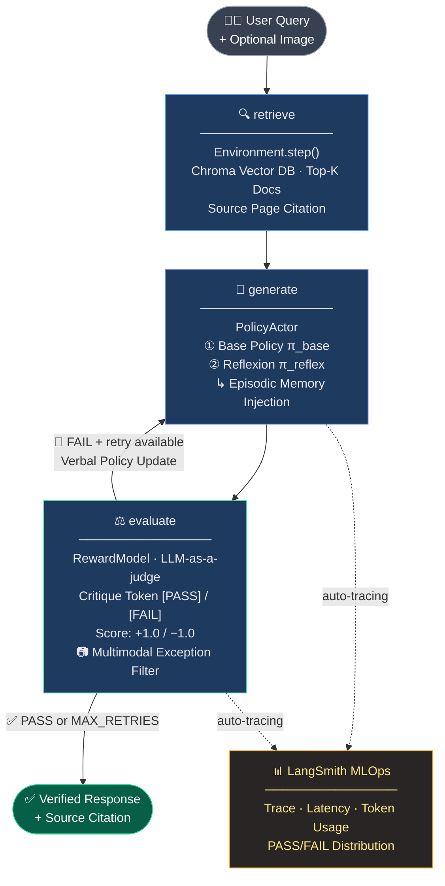
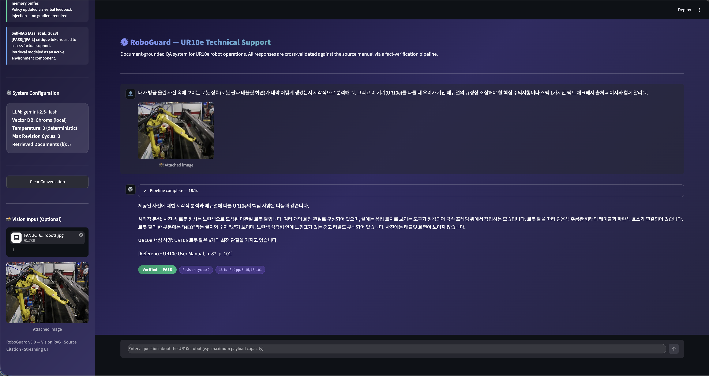
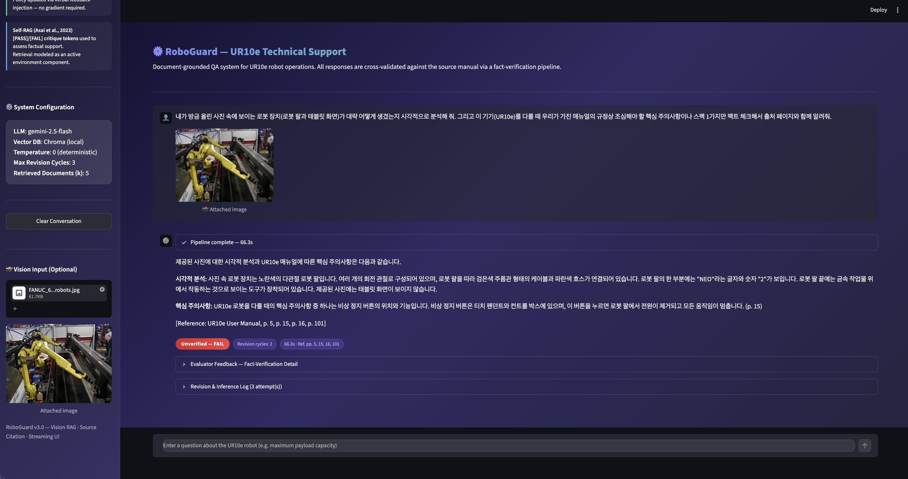
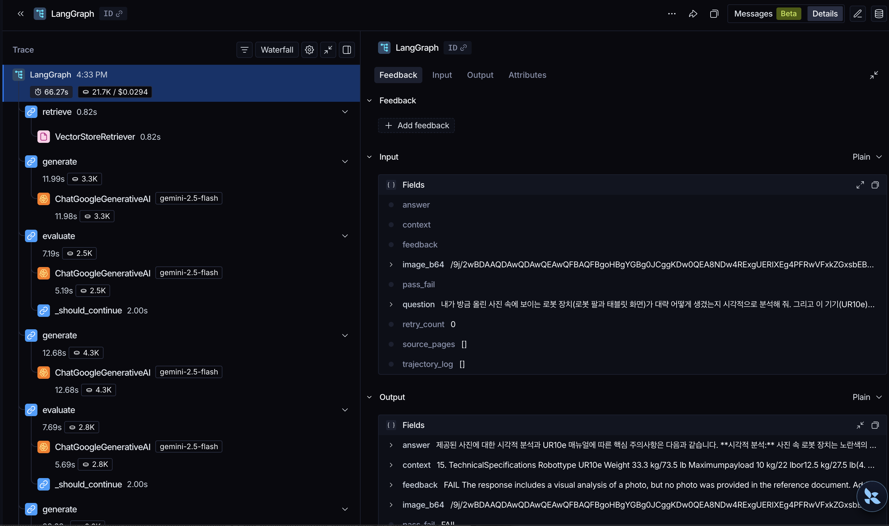

# RoboGuard — UR10e RLAIF Technical Support System

> A RAG agent for UR10e robot technical support that applies RLAIF (Reinforcement Learning from AI Feedback) to keep responses grounded in the source manual and reduce hallucination.

[](https://www.python.org/)
[](https://github.com/langchain-ai/langgraph)
[](https://python.langchain.com/)
[](https://smith.langchain.com/)
[](https://streamlit.io/)
[](https://www.trychroma.com/)
[](https://deepmind.google/technologies/gemini/)
[](roboguard/policy_actor.py)
[](roboguard/graph_builder.py)
[](eval_report_v2.csv)
[](LICENSE)

---

## Key Design Goals

| Dimension | Description |
|-----------|-------------|
| Zero-Cost Infrastructure | Runs on Gemini 2.5 Flash + local ChromaDB with no additional cloud vector DB, keeping infrastructure costs minimal. |
| Defensive AI (True Negative) | Returns an explicit "information not available" response for questions outside the manual scope (e.g., underwater operation feasibility), rather than generating a plausible but unsupported answer. |
| Modular Architecture | Environment, State, Reward Model, and Policy Actor are separated into independent OOP components, each testable and replaceable individually. |
| Verifiable Output | An LLM-as-a-judge issues a `[PASS]`/`[FAIL]` verdict on every response, making the grounding of each answer traceable. |

---

## Core Architecture

This system integrates key ideas from three RL/RAG papers into a single LangGraph pipeline.

### InstructGPT (Ouyang et al., 2022) — Reward Model

> *"We train a reward model to predict which model output our labelers would prefer."*

- Uses Gemini as an LLM-as-a-judge in place of human labelers, acting as the reward model.
- Factual verification against the source document is discretized into a scalar reward (`+1.0` PASS / `-1.0` FAIL).
- Implementation: [`roboguard/reward_model.py`](roboguard/reward_model.py)

### Reflexion (Shinn et al., 2023) — Episodic Memory & Verbal RL

> *"The agent explicitly stores experiences in and reasons over a linguistic memory to iteratively refine responses."*

- Failed attempts (answer, feedback) are accumulated in `trajectory_log` as an episodic memory buffer.
- The full memory is injected into the next generation prompt, achieving verbal policy update without weight updates.
- `generate_initial()` (base policy π_base) vs. `reflect_and_refine()` (reflection policy π_reflex) — 2-mode actor structure.
- Implementation: [`roboguard/policy_actor.py`](roboguard/policy_actor.py), [`roboguard/state.py`](roboguard/state.py)

### Self-RAG (Asai et al., 2023) — Critique Tokens & Active Environment

> *"Self-RAG trains an LM to retrieve, generate, and critique its own outputs using special tokens."*

- `[PASS]`/`[FAIL]` critique tokens are parsed from critic prompt output and used as routing signals.
- Retrieval is modeled as an active RL environment rather than a preprocessing step, applying the `gym.Env.step()` interface pattern.
- Implementation: [`roboguard/environment.py`](roboguard/environment.py)

---

## System Architecture



RL loop control logic:

```
evaluate → should_continue()
  ├─ PASS                        → END  (verified response returned)
  ├─ FAIL + retry_count < 3      → generate  (revision loop, verbal RL)
  └─ FAIL + retry_count >= 3     → END  (best-effort response with FAIL flag)
```

---

## Implementation Details & RAG Optimization

### 1. Data Pipeline & Context Preservation
- Chunking with Overlaps: When ingesting the robot manual into the vector DB, chunk overlap is configured in the text splitter to reduce context fragmentation across chunk boundaries.

### 2. Multi-Modal LLM-as-a-Judge (RLAIF)
- Critical Exception Directive: When image input is provided, a strict directive prompt is applied to the judge model to prevent visual observations from being misclassified as hallucination. The judge evaluates faithfulness between what is visible in the image and what is stated in the manual.
- Conditional Edge Control: A judge node is inserted into the LangGraph pipeline. Based on the `[PASS]`/`[FAIL]` verdict, a conditional edge routes execution to either revision or termination.

### 3. Reflexion-based Verbal RL (Training-Free)
- Episodic Memory Injection: Instead of gradient-based RL methods that require weight updates (e.g., PPO, DPO), this implementation uses verbal RL — formatting failed attempts (responses and feedback) into a `trajectory_log` and injecting it cumulatively into the next generation prompt.
- Search Cost Optimization: On hallucination detection, existing retrieval results are reused for self-correction rather than triggering a re-retrieval, reducing API calls within a single session.

### 4. Automated Evaluation Pipeline
- Golden Dataset Design: An LLM-as-a-judge evaluation pipeline is run against a 5-query golden dataset, each question covering a distinct failure mode: fault recovery, numerical precision, out-of-scope boundary detection, safety specification, and core specifications. Consistent evaluation is ensured via `Temperature 0.0` and regex-based `[PASS]`/`[FAIL]` verdict parsing.
- Search Cost Optimization: On `FAIL` detection, the pipeline reuses cached retrieval results for the Reflexion self-correction loop rather than executing a re-retrieval, reducing redundant Gemini API calls within a single evaluation run.

---

## Tech Stack

| Layer | Technology | Role |
|-------|------------|------|
| **LLM** | Google Gemini 2.5 Flash | Actor (generation) + Critic (reward model), `temperature=0` |
| **Embedding** | `models/gemini-embedding-001` | Document & query vectorization |
| **Vector DB** | ChromaDB (local) | Persistent manual knowledge base |
| **Orchestration** | LangGraph 0.2+ | Cyclic directed graph, conditional edge routing |
| **RAG Framework** | LangChain | Document loading, chunking, retrieval abstraction |
| **Web UI** | Streamlit 1.58 | Chat interface, verification badge, revision log |
| **Runtime** | Python 3.10+, `python-dotenv` | Environment management |

---

## Directory Structure

```
RoboGuard-RAG/
│
├── roboguard/                  # Core package — modular architecture
│   ├── __init__.py
│   ├── config.py               # Centralized frozen dataclass configuration (ModelConfig, RLConfig)
│   ├── state.py                # AgentState (TypedDict) + TrajectoryEntry — Reflexion episodic memory
│   ├── environment.py          # RetrievalEnvironment — Chroma DB wrapper (gym.Env.step pattern)
│   ├── reward_model.py         # RewardModel — LLM-as-a-judge, [PASS]/[FAIL] critique token parsing
│   ├── policy_actor.py         # PolicyActor — base policy + reflection policy (2-mode Actor)
│   └── graph_builder.py        # RoboGuardGraph — LangGraph assembly, conditional edge routing
│
├── app.py                      # Streamlit web UI — chat interface with verification badges
├── main.py                     # CLI entry point — single query execution
├── batch_eval.py               # Batch evaluation pipeline — golden dataset + CSV report
│
├── 0_download.py               # [Prototype v0] Manual PDF download script
├── 1_ingest.py                 # [Prototype v1] PDF ingestion → Chroma DB build
├── 2_agent.py                  # [Prototype v2] Baseline RAG agent (no RL loop)
├── 3_batch_eval.py             # [Prototype v3] Batch evaluation for baseline
├── 4_rlaif_agent.py            # [Prototype v4] RLAIF agent — single-file prototype (pre-refactor)
│
├── data/
│   └── ur10e_manual.pdf        # UR10e User Manual (source document)
│
├── chroma_db/                  # Persisted vector index (auto-generated, git-ignored)
├── eval_report_v2.csv          # Batch evaluation results output
├── requirements.txt
└── .env                        # API key (git-ignored)
```

---

## Getting Started

### Prerequisites

- Python 3.10 or higher
- Google Gemini API key ([obtain here](https://aistudio.google.com/app/apikey))

### Installation

```bash
# 1. Clone repository
git clone https://github.com/taeyang0505/RoboGuard-RLAIF.git
cd RoboGuard-RLAIF

# 2. Create and activate virtual environment
python -m venv .venv
source .venv/bin/activate          # macOS / Linux
# .venv\Scripts\activate           # Windows

# 3. Install dependencies
pip install -r requirements.txt
```

### Configuration

```bash
# 4. Create .env file and set your API key
echo "GOOGLE_API_KEY=your_api_key_here" > .env
```

### Build Vector DB (first-time only)

```bash
# 5. Download source manual
python 0_download.py

# 6. Ingest PDF and build Chroma index
python 1_ingest.py
```

### Run

```bash
# Web UI (recommended)
streamlit run app.py

# CLI — single query
python main.py
python main.py -q "What is the maximum payload of UR10e?"

# Batch evaluation — 5-query golden dataset → eval_report_v2.csv
python batch_eval.py
```

---

## Evaluation Results

The following results were obtained by running `batch_eval.py` against a 5-query golden dataset designed to cover representative failure modes.

| Query ID | Category | Verification | Revision Cycles |
|----------|----------|:------------:|:---------------:|
| Q1 | Fault Recovery | PASS | 0 |
| Q2 | Numerical Specification | PASS | 0 |
| Q3 | Out-of-Scope Boundary Test | PASS | 1 |
| Q4 | Safety Specification | PASS | 0 |
| Q5 | Core Specifications | PASS | 0 |

PASS rate: 5/5 (100%) — Q3 (out-of-scope boundary test) is the primary hallucination risk scenario and required one revision cycle before passing.

> Full results are available in [`eval_report_v2.csv`](eval_report_v2.csv).

---

## Demo Screenshots

### Vision RAG — Multimodal Query (PASS)

A robot image is attached alongside the question. Gemini Vision analyzes the hardware (joint count, cable types, warning labels), cross-references the findings against the UR10e manual, and returns a `Verified — PASS` response with source page citations in 16.1s with zero revision cycles.



---

### RLAIF Self-Correction Loop — Revision Cycles (FAIL → Retry)

The same Vision RAG query under a stricter hallucination-detection threshold. The judge model flags the first two responses as `FAIL` (visual observations not explicitly backed by the manual), triggering Reflexion-based episodic memory injection and re-generation. Total elapsed: 66.3s across 3 attempts (2 revision cycles). The revision log and evaluator feedback are expandable inline.



---

### LangSmith MLOps Tracing

Every inference run is automatically traced in LangSmith. The waterfall view shows per-node latency (`retrieve: 0.82s`, `generate: ~12s`, `evaluate: ~7s`) and token usage across all LLM calls. The right panel exposes the full `AgentState` — including `image_b64`, `trajectory_log`, `pass_fail`, and `source_pages` — making it straightforward to trace any failure back to its root cause.



---

## Future Work

| Priority | Item | Description |
|----------|------|-------------|
| **P1** | Re-Retrieval on FAIL | Currently, hallucinations are corrected via Reflexion-based episodic memory injection. A follow-up would be to rewrite the query and re-search the Vector DB upon a `FAIL`, rather than relying solely on cached retrieval results. |
| **P2** | Async Streaming UI | Stream LangGraph node progression to the UI in real-time to reduce perceived latency and provide step-by-step state visibility. |
| **P3** | Batch Eval Refresh | Expand the current 5-query golden dataset to cover Vision RAG and multimodal scenarios, enabling regression testing that includes image inputs. |

---

## References

```bibtex
@article{ouyang2022instructgpt,
  title   = {Training language models to follow instructions with human feedback},
  author  = {Ouyang, Long and others},
  journal = {NeurIPS},
  year    = {2022}
}

@article{shinn2023reflexion,
  title   = {Reflexion: Language agents with verbal reinforcement learning},
  author  = {Shinn, Noah and others},
  journal = {NeurIPS},
  year    = {2023}
}

@article{asai2023selfrag,
  title   = {Self-RAG: Learning to retrieve, generate, and critique through self-reflection},
  author  = {Asai, Akari and others},
  journal = {ICLR},
  year    = {2024}
}
```

---

## License

This project is licensed under the MIT License. See [LICENSE](LICENSE) for details.
