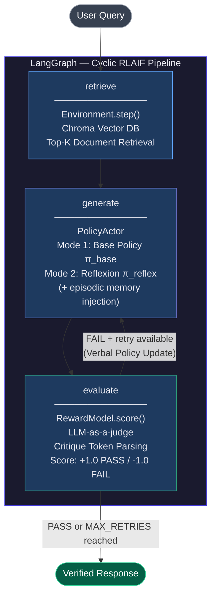

# RoboGuard — UR10e RLAIF Technical Support System

> 산업용 로봇 매뉴얼 기반, 환각(Hallucination) 방지를 위해 최신 강화학습(RLAIF) 아키텍처를 도입한 엔터프라이즈 RAG 에이전트.  
> An enterprise-grade RAG agent for UR10e robot technical support, applying RLAIF (Reinforcement Learning from AI Feedback) to achieve verifiable, document-grounded responses.

[](https://www.python.org/)
[](https://github.com/langchain-ai/langgraph)
[](https://streamlit.io/)
[](https://www.trychroma.com/)
[](https://deepmind.google/technologies/gemini/)
[](LICENSE)

---

## Key Business Value

| Dimension | Description |
|-----------|-------------|
| **Zero-Cost Infrastructure** | Gemini 2.5 Flash + Local Chroma DB 조합으로 별도 클라우드 Vector DB 없이 운영. 인프라 유지 비용 최소화. |
| **Defensive AI (True Negative)** | 매뉴얼에 존재하지 않는 질문("수심 10m 수중 작업 가능 여부")에 대해 모른다고 명확히 응답하는 산업 안전 관점의 팩트체크 방어 로직 구현. |
| **Production-Grade Modularity** | 단일 스크립트(prototype)에서 Environment / State / Reward Model / Policy Actor를 OOP로 완전 분리. 컴포넌트 단독 테스트 및 교체 가능. |
| **Verifiable Output** | LLM-as-a-judge가 매 응답에 `[PASS]`/`[FAIL]` 검증 토큰을 발행. 답변의 근거를 추적 가능한 구조로 설계. |

---

## Core Architecture

이 시스템은 3개의 최신 RL/RAG 논문의 핵심 아이디어를 단일 LangGraph 파이프라인으로 통합합니다.

### InstructGPT (Ouyang et al., 2022) — Reward Model

> *"We train a reward model to predict which model output our labelers would prefer."*

- **구현**: Gemini LLM을 인간 레이블러 대신 LLM-as-a-judge로 활용하는 **Reward Model** 설계.
- 문서 기반 사실 검증 결과를 스칼라 보상(`+1.0` PASS / `-1.0` FAIL)으로 이산화.
- 구현 위치: [`roboguard/reward_model.py`](roboguard/reward_model.py)

### Reflexion (Shinn et al., 2023) — Episodic Memory & Verbal RL

> *"The agent explicitly stores experiences in and reasons over a linguistic memory to iteratively refine responses."*

- **구현**: 실패한 시도(answer, feedback)를 `trajectory_log`에 누적하는 **에피소딕 메모리 버퍼** 구현.
- 메모리 전체를 다음 생성 프롬프트에 주입하여, **가중치 업데이트 없이 Verbal Policy Update**를 달성.
- `generate_initial()` (기본 정책 π_base) vs. `reflect_and_refine()` (반성 정책 π_reflex) 2-mode Actor 구조.
- 구현 위치: [`roboguard/policy_actor.py`](roboguard/policy_actor.py), [`roboguard/state.py`](roboguard/state.py)

### Self-RAG (Asai et al., 2023) — Critique Tokens & Active Environment

> *"Self-RAG trains an LM to retrieve, generate, and critique its own outputs using special tokens."*

- **구현**: `[PASS]`/`[FAIL]` 구조화 Critique Token을 Critic 프롬프트 출력에서 파싱하여 라우팅 신호로 사용.
- 검색(Retrieval)을 전처리 단계가 아닌 RL **능동적 환경(Environment)**으로 모델링. `gym.Env.step()` 인터페이스 패턴 적용.
- 구현 위치: [`roboguard/environment.py`](roboguard/environment.py)

---

## System Architecture



**RL 루프 제어 로직:**

```
evaluate → should_continue()
  ├─ PASS                        → END  (verified response returned)
  ├─ FAIL + retry_count < 3      → generate  (revision loop, verbal RL)
  └─ FAIL + retry_count >= 3     → END  (best-effort response with FAIL flag)
```

---

## Tech Stack

| Layer | Technology | Role |
|-------|------------|------|
| **LLM** | Google Gemini 2.5 Flash | Actor (generation) + Critic (reward model), `temperature=0` |
| **Embedding** | `models/gemini-embedding-001` | Document & query vectorization |
| **Vector DB** | ChromaDB (local) | Persistent manual knowledge base |
| **Orchestration** | LangGraph 0.2+ | Cyclic directed graph, conditional edge routing |
| **RAG Framework** | LangChain | Document loading, chunking, retrieval abstraction |
| **Web UI** | Streamlit 1.58 | Chat interface, verification badge, revision log |
| **Runtime** | Python 3.10+, `python-dotenv` | Environment management |

---

## Directory Structure

```
RoboGuard-RAG/
│
├── roboguard/                  # Core package — production-grade modular architecture
│   ├── __init__.py
│   ├── config.py               # Centralized frozen dataclass configuration (ModelConfig, RLConfig)
│   ├── state.py                # AgentState (TypedDict) + TrajectoryEntry — Reflexion episodic memory
│   ├── environment.py          # RetrievalEnvironment — Chroma DB wrapper (gym.Env.step pattern)
│   ├── reward_model.py         # RewardModel — LLM-as-a-judge, [PASS]/[FAIL] critique token parsing
│   ├── policy_actor.py         # PolicyActor — base policy + reflection policy (2-mode Actor)
│   └── graph_builder.py        # RoboGuardGraph — LangGraph assembly, conditional edge routing
│
├── app.py                      # Streamlit web UI — chat interface with verification badges
├── main.py                     # CLI entry point — single query execution
├── batch_eval.py               # Batch evaluation pipeline — golden dataset + CSV report
│
├── 0_download.py               # [Prototype v0] Manual PDF download script
├── 1_ingest.py                 # [Prototype v1] PDF ingestion → Chroma DB build
├── 2_agent.py                  # [Prototype v2] Baseline RAG agent (no RL loop)
├── 3_batch_eval.py             # [Prototype v3] Batch evaluation for baseline
├── 4_rlaif_agent.py            # [Prototype v4] RLAIF agent — single-file prototype (pre-refactor)
│
├── data/
│   └── ur10e_manual.pdf        # UR10e User Manual (source document)
│
├── chroma_db/                  # Persisted vector index (auto-generated, git-ignored)
├── eval_report_v2.csv          # Batch evaluation results output
├── requirements.txt
└── .env                        # API key (git-ignored)
```

---

## Getting Started

### Prerequisites

- Python 3.10 or higher
- Google Gemini API key ([obtain here](https://aistudio.google.com/app/apikey))

### Installation

```bash
# 1. Clone repository
git clone https://github.com/taeyang0505/RoboGuard-RLAIF.git
cd RoboGuard-RLAIF

# 2. Create and activate virtual environment
python -m venv .venv
source .venv/bin/activate          # macOS / Linux
# .venv\Scripts\activate           # Windows

# 3. Install dependencies
pip install -r requirements.txt
```

### Configuration

```bash
# 4. Create .env file and set your API key
echo "GOOGLE_API_KEY=your_api_key_here" > .env
```

### Build Vector DB (first-time only)

```bash
# 5. Download source manual
python 0_download.py

# 6. Ingest PDF and build Chroma index
python 1_ingest.py
```

### Run

```bash
# Web UI (recommended)
streamlit run app.py

# CLI — single query
python main.py
python main.py -q "What is the maximum payload of UR10e?"

# Batch evaluation — 5-query golden dataset → eval_report_v2.csv
python batch_eval.py
```

---

## Evaluation Results

The following results were obtained by running `batch_eval.py` against a 5-query golden dataset designed to cover representative failure modes.

| Query ID | Category | Verification | Revision Cycles |
|----------|----------|:------------:|:---------------:|
| Q1 | Fault Recovery | PASS | 0 |
| Q2 | Numerical Specification | PASS | 0 |
| Q3 | Out-of-Scope Boundary Test | PASS | 1 |
| Q4 | Safety Specification | PASS | 0 |
| Q5 | Core Specifications | PASS | 0 |

**PASS rate: 5/5 (100%)** — including the out-of-scope boundary test (Q3), which is the primary hallucination risk scenario.

> Full results are available in [`eval_report_v2.csv`](eval_report_v2.csv).

---

## Future Work

| Priority | Item | Description |
|----------|------|-------------|
| **P1** | Source Citation | 검색된 청크의 원본 페이지 번호 및 섹션 메타데이터를 응답에 함께 표시. 출처 추적 가능한 Explainable AI 구현. |
| **P2** | Async Streaming UI | LangGraph 노드 진행 상황을 실시간 스트리밍으로 UI에 중계. 체감 대기시간 단축 및 단계별 상태 가시성 확보. |
| **P3** | Multimodal RAG | 매뉴얼 내 회로도, 부품 스펙 테이블, 경고 아이콘 등 비정형 시각 데이터 인식 및 검색 통합 (Vision RAG). |
| **P4** | MLOps Integration | LangSmith 연동을 통한 파이프라인 트레이싱, Reward 분포 모니터링, 응답 품질 드리프트 감지 자동화. |

---

## References

```bibtex
@article{ouyang2022instructgpt,
  title   = {Training language models to follow instructions with human feedback},
  author  = {Ouyang, Long and others},
  journal = {NeurIPS},
  year    = {2022}
}

@article{shinn2023reflexion,
  title   = {Reflexion: Language agents with verbal reinforcement learning},
  author  = {Shinn, Noah and others},
  journal = {NeurIPS},
  year    = {2023}
}

@article{asai2023selfrag,
  title   = {Self-RAG: Learning to retrieve, generate, and critique through self-reflection},
  author  = {Asai, Akari and others},
  journal = {ICLR},
  year    = {2024}
}
```

---

## License

This project is licensed under the MIT License. See [LICENSE](LICENSE) for details.
